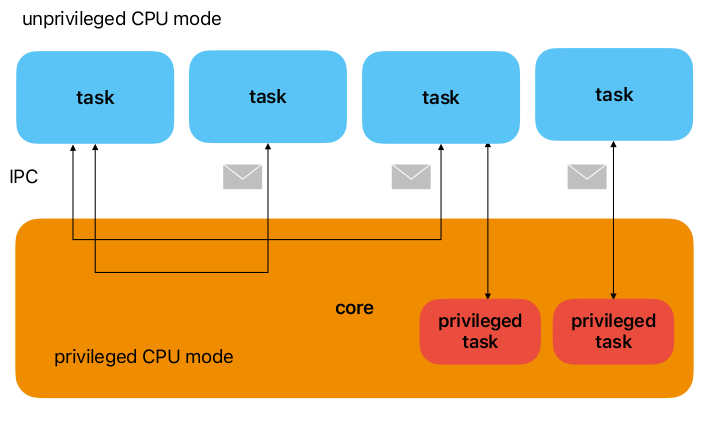
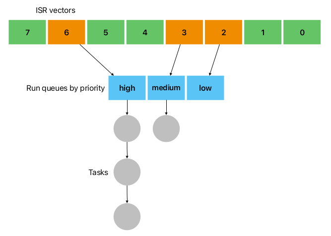
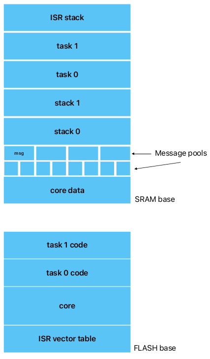
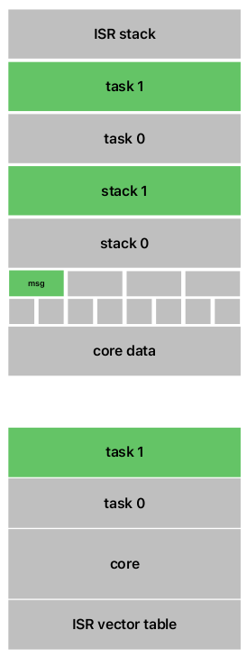
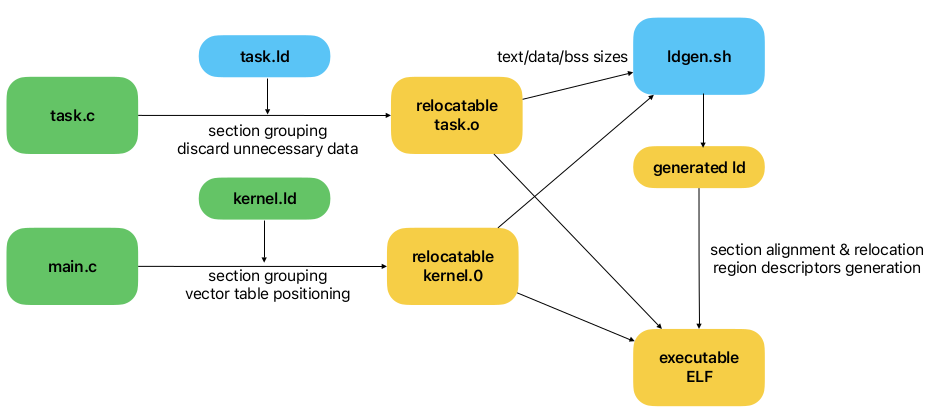

Actinium
========

Actinium is a microcontroller framework implementing actor-based execution 
model. It provides both hardware-assisted scheduling and memory protection 
for fault isolation.
Please note it is still in pre-alpha stage and isn't ready for any use except
research and experiments. This readme is also incomplete and will be updated 
over time...

Architecture
------------

Executable image consists of number of task and a core containing system
services. Each task contains exactly one actor which is a run-to-completion
stackless coroutine. Actors communicate using channels and messages.
Each task runs in memory-protected domain and have no direct access to 
neither core nor peripherals. It is assumed that executable image is 
deployed as a whole, so tasks can't be created or destroyed at runtime.

Each task is assigned a fixed priority and each priority corresponds to
some (unused by the user application) interrupt vector. This approach 
allows to use interrupt controller as a hardware-implemented scheduler.

For example, figure below depicts three vectors assigned to three runqueues.

Note that vector is assigned to priority level, not actor. So number of
vectors that have to be reserved for scheduling is always finite and limited,
whereas number of tasks/actors is unlimited.

Most Cortex-M chips define 'priority bits' for NVIC as 3-5, so number 
of distinct priority levels is 8-32.
Other vectors unused by scheduling behave as expected and are not used by the
framework in any way.

Features
--------

- Preemptive multitasking
- Cooperative scheduling within a single priority level
- Actors are separately compiled and run in unprivileged mode
- Region-based memory protection using MPU
- Message passing IPC
- Timer services with 'sleep for' functionality
- Only ARM Cortex-M3/M4 (with MPU) are supported at now

Design principles
-----------------

1.  **Actor-based execution model (Hoare's CSP).**
    Most of MCU-based embedded systems are reactive so full-fledged threads
    are often too heavyweight because of the requirement to allocate a stack
    for each thread. Actors use one stack per **priority level**.
2.  **Hardware-assisted scheduling.**
    Modern interrupt controllers implement priority-based actor model in 
    hardware. Actor's priorities are mapped to interrupt priorities, thus
    scheduling and preemption operations are effectively implemented by
    the interrupt controller. It boosts performance and reduces code size.
3.  **Memory protection.**
    Actinium is designed for embedded systems with reliability requirements.
    Any actor may be compiled as separate executable and isolated within 
    memory regions using MPU (memory protection unit). Actor crash may not
    cause the whole system to fail.
4.  **Zero-copy message-passing communication.**
    Actors communicate using messages and channels. However, messages are
    always passed by references, so sending 1Kb and 1Gb message takes exactly
    the same time. Message passing is the only communication method at now.
5.  **Fault-tolerance and 'let it crash' principle.**
    When the framework encounters crash condition, e.g. invalid memory 
    reference, wrong syscall number, exception, etc. the erronous actor 
    is automatically marked for restart.

Reliability
-----------

The system is protected from the following bugs/attack vectors:

- **use of wrong channels**: channels that are used by unprivileged actors 
  are identified by ids, not pointers. Ids are validated before use, 
  therefore actors cannot post to/get messages from arbitrary channels, only
  allowed ones may be used. Also it is impossible to post message of wrong 
  type since both messages and channels have type ids.
- **message leaks**: actor is allowed to own just a single message at any 
  time. Post/get another message causes the owned message to be freed. Actor 
  crash is also frees the message.
- **memory unsafety**: invalid instructions or memory references beyond 
  allowed areas cause exceptions and restart of the actor.
- **stack corruption**: insufficient stack space including the case of 
  preemption is also detected and causes the actor to restart.

The kernel part does not use any pointers to unprivileged data, so syscall 
interface may not by subjected to this type of attacks. In the current 
version stacks/registers are not cleared between actor activations for 
performance reasons. This may cause data leaks between actors, but may be 
fixed if needed. Actors should not have access to DMA controller, otherwise 
any protection may be compromised.

Memory regions and MPU
----------------------

Currently, 5 regions are used for each unprivileged actor.
- Code (flash)
- Data (SRAM, also includes .bss)
- Stack
- Currently owned message (optional)
- ‘User’ region for peripheral access (optional)

I plan to remove restrictions and allow to set the number of regions per 
actor individually but this is not implemented yet.

Because of hardware restrictions of the MPU, messages should be:
- at least 32 bytes size
- aligned to its size
- sized to power of 2

Typical memory layout for two tasks and two priority levels is shown below.

When the task1 is active MPU is programmed to allow access to memory shown as
green:

A task may have access to single message at any moment.

Using devices/interrupts
------------------------

Actors who need to communicate with devices may be granted access to 
peripheral memory. Interrupts are not directly accessible and should 
be redirected to channels as messages by the kernel part of application if 
needed.

Building
--------

Building is a little complex since we have to pack many relocatable files
into single ELF with proper alignment. 

First, the core part containing MCU initialization is compiled using its
linker script into relocatable kernel.0 file. Note that extension is 
numeric 0, not o. This file is expected to have vector table and have to be
placed first.

Second, user tasks are compiled into regular relocatable object files using
framework-provided linker script. It has no deal with addresses, just
rearrange sections.
All relocatable files should have sections text/data/bss (possibly zero-sized),
other sections are ignored.

Third, ldgen.sh script extracts section sizes for *.o and kernel.0 files and
generates linker script packing the files together with proper alignment.
Also it provides section sizes in a special symbol so kernel may
further use this info when spawning tasks.
That's it.

On figure below user-provided parts are shown as green, framework-provided
parts are shown as blue, and generated files are showh as yellow.

Syscalls
--------

Syscalls are the only way to communicate with the core and the other tasks.

| syscall      | description |
|--------------|-------------|
|subscribe | causes actor to end execution and to subscribe to the channel specified |
|delay     | re-activates actor execution after the given period |
|send      | post the currently owned message into the channel |
|try_pop   | polls a channel synchronously |
|alloc     | allocate new message and save it inside the actor struct |
|free      | free the owned message |

Files
-----

| file at /core  | description |
|----------------|-------------|
|arch/armv7m/ac_port.h      | hardware abstraction layer interface for ARMv7-M |
|arch/armv7m/actinium.s     | low-level interrupt/syscall entries |
|arch/armv7m/core*.h        | CMSIS headers by ARM |
|arch/armv7m/task_startup.s | low-level task initialization |
|actinium.h                 | cross-platform framework functions |
|task.ld                    | linker script for tasks |
|ldgen.sh                   | linker script generator to place kernel and actors in memory |

The demo
--------

The demo contains two tasks or actors: sender and controller. The sender sends
requests to toggle LED to 'controller' who has access to the corresponding 
peripheral. Both actors constantly crash after few activations but they're 
gently restarted by exceptions and the system continues to work.
This demonstrates 'let it crash' principle: even when no task is reliable 
the whole system works as designed.
To build the demo run

        make

in the demo folder (provided that arm-none-eabi- toolchain is available via 
PATH). This yields image.elf file containing all the tasks and the kernel
ready for flashing.

FAQ
---

TODO

How to use
----------

TODO

API description
---------------

TODO

Why Actinium?
-------------

It is two words 'actor' and 'tiny' combined in a way to form chemical element 
name. Also it emphasizes that this is an evolution of the magnesium framework.

